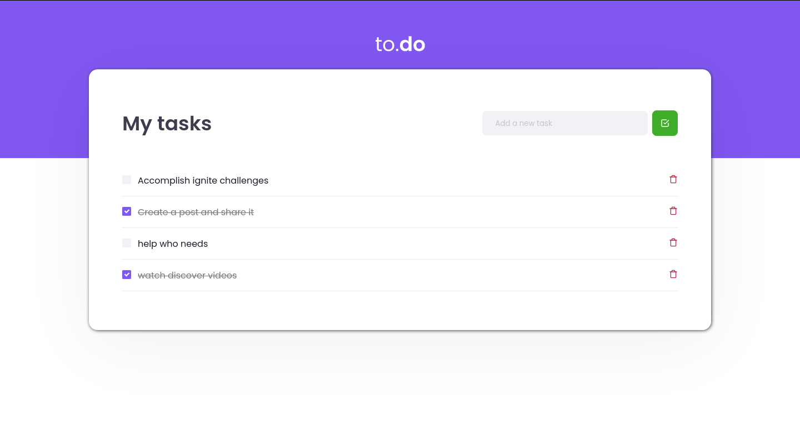

# TodoList with ReactJS - Rocketseat Ignite

<a href="https://pt-br.reactjs.org/" target="blank"></a>
<a href="https://sass-lang.com/" target="blank"></a>
<a href="https://www.typescriptlang.org/" target="blank"></a>
<a href="https://jestjs.io/pt-BR/" target="blank"></a>

Hello everybody, here I keep my code developed during the first challenge from Ignite platform (rocketseat). Basically I built a simple todo list using typescript and sass. The template was simple and beautiful, but after apply the main functionalities I wanted to let the application more unique, so I change the colors besides to apply responsiveness.

## Status

🚀 ...released... 🚀

## Requirements and How to use

To run this application locally you just need to install [node](https://nodejs.org/en/) in your computer. By doing that npm (node package manager) will be installed too. So know you can start the application by running:

```bash
# Install all dependencies
npm install

# Start the application
npm run dev

# apply tests
npm test
```

If you prefer you can run by using `yarn` instead:

```bash
# Install yarn in computer globally
npm install yarn --global

# Install all dependencies with yarn
yarn

# Start the application with yarn
yarn dev

# apply tests with yarn
yarn test
```

## Preview



## Techonologies

- REACTJS
- WEBPACK + BABEL
- TYPESCRIPT
- SASS
- GOOGLE FONTS

_This project was built whithout `create-react-app` or `vite`. It was built from zero to learn the structure of a ReactJS App._

> **The project does not maintain the data. If you like, fell free to contribute with features to store data in `BaaS`(firebase, supabase),localStorage or any other feature.**

### EDITOR

- [Visual Studio Code](https://code.visualstudio.com/)

---

## 💪 How to contribute to the project

1. **Fork** the project.

2. Create a new branch with your changes: `git checkout -b my-feature`

3. Save the changes and create a commit message telling what you did: `git commit -m "feature: My new feature"`

4. Push your changes: `git push origin my-feature`

> If you have any questions, check out this [guide on how to contribute on GitHub](./CONTRIBUTING.md)

## Author

<div>


<sub><b>Victor Hugo 🚀</b></sub>

## 📝 Licença

This project is under MIT license [MIT](./LICENSE).

Made with dedication by VictorSilva15

---
